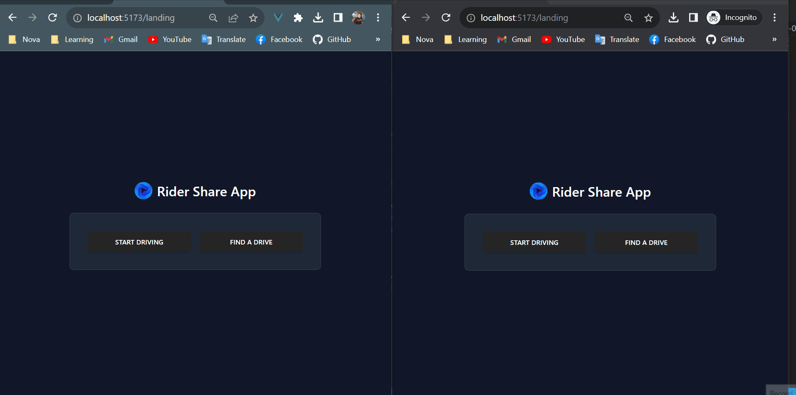

## Name
Rider Share App with Laravel 10, Vue 3 and websocket

## Setup Guide for Laravel
```
git clone https://github.com/Htet-Htet-Oo-Wai/rider-share-app-with-vuejs.git
cd into cloned project folder
cd rider-share-backend
run composer install
copy of .env.example and rename it to .env
change DB section with your local MySQL database setting
create new database in your local MySQL
run php artisan migrate:fresh --seed
run php artisan key:generate
run php artisan serve
run php artisan websocket:serve
```

## Setup Guide for Vue
```
cd into cloned project folder
cd rider-share-frontend
run npm install
run with npm run dev or npm run dev -- --port 9000 if you want to specify a port
```

## Versions
- PHP => ^8.1
- Laravel framework => ^10.10
- MySQL => 8.0
- node => v18.13.0
- Vue => ^3.3.4
- vue-router => ^4.2.5
  
## Project Demo

